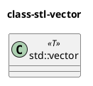

## source 

A Tour of C++, https://stackoverflow.com/questions/388242/the-definitive-c-book-guide-and-list

> C++17

## Basic

### Type & Variable

A declaration is a statement that introduces an entity into the program. It
specifies a type for the entity:

> A type defines a set of possible values and a set of operations (for an object).
> An object is some memory that holds a value of some type.
> A value is a set of bits interpreted according to a type.
> A variable is a named object.

### curly-brace-delimited initializer list

it saves you from conversions that lose information:

```cpp
double d1 = 2.3; // initialize d1 to 2.3
double d2 {2.3}; // initialize d2 to 2.3
double d3 = {2.3}; // initialize d3 to 2.3 (the = is optional with { ... })

int i1 = 7.8;   // i1 becomes 7
int i2 {7.8};   // error: narrowing conversions
```

### declare & definition & initialize

https://stackoverflow.com/questions/23345554/the-differences-between-initialize-define-declare-a-variable

declare: introduce sth to compiler
definition: i'm here, give me some memory
init: assignment

### constant

**A constant cannot be left uninitialized** and a variable should only be
left uninitialized in extremely rare circumstances. Don’t introduce a name until
you have a suitable value for it.

const: 
1. "i promise not to change the value", but can be `const_cast`
2. The value of a const can be calculated at **run time**.

> The use of const_cast for any reason other than adapting to (old) libraries where the interfaces have non-const pointers/references but the implementations don't modify the arguments is wrong and dangerous.

constexpr:
1. "to be evaluated at **compile time**."
2. The value of a constexpr must be calculated by the compiler.

constexpr function, arg can be both const and non

```cpp
constexpr double square(double x) { return x*x; }
constexpr double max1 = 1.4*square(17); // OK 1.4*square(17) is a constant expression
constexpr double max2 = 1.4*square(var); // error: var is not a constant expression
const double max3 = 1.4*square(var); // OK, may be evaluated at run time
```

`cont int* a` & `int const* a`

**clockwise/spiral rules**, http://c-faq.com/decl/spiral.anderson.html

[What is the difference between const int*, const int * const, and int const *?](https://stackoverflow.com/questions/1143262/what-is-the-difference-between-const-int-const-int-const-and-int-const)

Example #1: Simple declaration
                     +-------+
                     | +-+   |
                     | ^ |   |
                char *str[10];
                 ^   ^   |   |
                 |   +---+   |
                 +-----------+
Question we ask ourselves: What is str?
  str is an...
We move in a spiral clockwise direction starting with `str` and the first character we see is a `[` so, that means we have an array, so...
  str is an array 10 of...
Continue in a spiral clockwise direction, and the next thing we encounter is the `*` so, that means we have pointers, so...
  str is an array 10 of pointers to...
Continue in a spiral direction and we see the end of the line (the `;`), so keep going and we get to the type `char`, so...
  str is an array 10 of pointers to char
We have now visited every token; therefore we are done!


```cpp
const int* p1;  // p1 is a pointer to int const
int* const p2;  // p2 is a const pointer to int
```

### range-for-statement

The range-for-statement can be used for **any sequence of elements**

```cpp
void print() {
    int a[] = {5, 2, 3, 4, 1};
    for (auto i : a) cout << i << '\n';
}
```

### reference & pointer

> A reference is similar to a pointer, except that you don’t need to use a prefix * to access the value
> referred to by the reference. Also, a reference cannot be made to refer to a
> different object after its initialization.

### Tests if(p)

if p not null

> A test of a numeric value (e.g., `while (*p)` in count_x()) is equivalent to
> comparing the value to 0 (e.g., `while (*p!=0)`). A test of a pointer value (e.g., `if (p)`)
> is equivalent to comparing the value to nullptr (e.g., `if (p!=nullptr)`).

if-statement can introduce a variable and test it

```cpp
void do_something(vector<int>& v)
{
    if (auto n = v.size(); n!=0) {
        // ... we get here if n!=0 ...
    }
    // ...
}

void do_something(vector<int>& v)
{
    if (auto n = v.size()) {    // return n
        // ... we get here if n!=0 ...
    }
    // ...
}
```

### Mapping to hardware

### Advice

```
[7] A function should perform a single logical operation; §1.3 [CG: F.2].
[8] Keep functions short; §1.3; [CG: F.3].
[12] Use digit separators to make large literals readable; §1.4; [CG: NL.11].
[16] Avoid “magic constants”; use symbolic constants; §1.6; [CG: ES.45].
[19] Keep common and local names short, and keep uncommon and nonlocal names longer; [CG: ES.7].
[26] When declaring a variable in the condition of an if-statement, prefer the version with the implicit test against 0; §1.8.
```

## User-Defined Types

### Struct & class

struct: public default
class: private default

**struct binding**

```cpp
struct Entry {
  string name;
  int value;
};
Entry read_entry(istream& is) // naive read function (for a better version, see §10.5)
{
  string s;
  int i;
  is >> s >> i;
  return {s,i};
}
auto [n, v] = read_entry(cin);

map<string,int> m; // ... fill m ...
for (const auto [key,value] : m)
  cout << "{" << key "," << value << "}\n";
```

### Union

A union is a struct in which all members are allocated at the same address so
that the union occupies only as much space as its **largest member**.
 
For example, consider a
symbol table entry that holds a name and a value. The value can either be a
Node* or an int:

```cpp
enum Type { ptr, num }; // a Type can hold values ptr and num (§2.5)

struct Entry {
  string name; // string is a standard-library type
  Type t;
  Node* p; // use p if t==ptr
  int i; // use i if t==num
};

void f(Entry* pe) {
  if (pe−>t == num)
    cout << pe−>i;
  // ...
}

// p and i never used at the same time, space wasted

union Value {
  Node* p;
  int i;
};
struct Entry {
  string name;
  Type t;
  Value v;  // use v.p if t == ptr; v.i if if t == num;
}

void f(Entry *p) {
  if (p->t == Type::num)
    cout << p->v.i;
}
```

The language doesn’t keep track of which kind of value is held by a union, so the
programmer must do that:
Maintaining the correspondence between a type field (here, t) and the type.

**Naked union**

The standard library type, `variant`, can be used to eliminate most direct uses
of unions. A variant stores a value of one of a set of alternative types (§13.5.1).
For example, a `variant<Node*,int>` can hold either a Node* or an int.
Using variant, the Entry example could be written as:

```cpp
struct Entry {
  string name;
  variant<Node*,int> v;
};
void f(Entry* pe) {
  if (holds_alternative<int>(pe−>v)) // does *pe hold an int? (see §13.5.1)
    cout << get<int>(pe−>v); // get the int
  // ...
}
```

### scoped enum class

```cpp
enum class Color {red, green, blue};

enum Color {red, green, blue}
```

convert to "underlying type", must be explicitly for scoped enum class

### Advice

```
[3] Represent the distinction between an interface and an implementation using a class; §2.3; [CG: C.3].
```

## Modularity

### Seperate Compilation

interface and implemetaion

### Modules C++20

### Namespace

using-declaration
using-directive

```cpp
using std::swap; // use the standard-library swap
// ...
swap(x,y);

using namespace std;
```

### Error Handling

Exception

```cpp
double& Vector::operator[](int i) {
  if (i<0 || size()<=i)
    throw out_of_range{"Vector::operator[]"};
  return elem[i];
}

void f(Vector& v) {
  // ...
  try{ // exceptions here are handled by the handler defined below
    v[v.size()] = 7; // try to access beyond the end of v
  }
  catch (out_of_range& err) { // oops: out_of_range error
    // ... handle range error ...
    cerr << err.what() << '\n';
  }
  // ...
}
```

`noexcept`: A function that should never throw an exception can be declared noexcept.

```cpp
void user(int sz) noexcept {
  Vector v(sz);
  iota(&v[0],&v[sz],1); // fill v with 1,2,3,4... (see §14.3)
  // ...
}
```

If all good intent and planning fails, so that user() still throws,
`std::terminate()` is called to immediately terminate the program.

Don’t overuse try-statements.

The main technique for making error handling simple and systematic
(called **Resource Acquisition Is Initialization; RAII**) is explained in §4.2.2. The
basic idea behind RAII is for a constructor to acquire all resources necessary for
a class to operate and have the destructor release all resources, thus making
resource release guaranteed and implicit

**Invariants**

Such a statement of what is assumed to be true for a class is
called a class invariant, or simply an invariant.

In well-designed code try-blocks are rare. Avoid overuse by systematically
using the RAII technique


## classes

**constructor and destructor**

cons, inside to outside
des, out to inside

```
class Outter {
  private:
    Inner mInner;
}

Innner ctor
Outter ctor
Outter ~dtor
Inner ~dtor
```

### Concrete Types

```cpp
class Vector_container : public Container {
    public:
        explicit Vector_container(int size) : sz {size}, elem {new double[sz]} {
            for (size_t i = 0; i < sz; i++) elem[i] = i * i;
        }
        Vector_container(std::initializer_list<double> lst);
        Vector_container() : sz(0), elem(nullptr) {}
        int size() override { return sz; }
        double& operator[] (int i) override { return elem[i]; }
        ~Vector_container() override { if(elem) delete[] elem; }
    private:
        int sz;
        double* elem;
};

Vector_container::Vector_container(std::initializer_list<double> lst)
    : sz(lst.size()), elem(new double[lst.size()]) {
    std::copy(lst.begin(), lst.end(), elem);
}

class Complex {
  public:
    Complex(double re = 0, double im = 0);
    Complex operator+(const Complex& other);
    Complex operator-(const Complex& other);
  private:
    double re;
    double im;
}
```

all concrete, 

- refer to objects directly (and not just through pointers or references)
- initialize objects immediately and completely (e.g., using constructors; §2.3); and
- copy and move objects (§5.2).

**implicit conversion**

be careful to ctor with one arg

```cpp
Vector v1 = 7;

explicit Vector(int size);
```

`std::initialize_list<T>`

```cpp
class Vector {
  public:
    Vector(int size);
    ~Vector();
    Vector(std::initialize_list<double> lst);
  private:
    int sz;
    double* elem;
};

Vector::Vector(std::initialize_list<double> lst) : sz(lst.size()),
  elem {new double[lst.size()]} {
    std::copy(lst.begin(), lst.end(), elem);
}
```

### Abstract Types

Container, Shape. 

### Virtaul Functions

virtual function table

Each **class with virtual functions** has its own vtbl identifying its virtual
functions.

**space overhead** 

1. one pointer in each object of a class with virtual functions 
2. one vtbl for each such class.

### Class Hierarchies

virtual destructor

inside -> outside -> inside

`dynamic_case`

"is this `Shape` a kind of `Circle`"

```cpp
Shape* ps {read_shape(cin)};
if (Circle* p = dynamic_cast<Circle*>(ps)) { // ... does ps point to a Circle? ...
  // ... a Circle; use it
} else {
  // ... not a Circle, try something else ...
}
```

### Advice

```
[13] If a class is a container, give it an initializer-list constructor; §4.2.3; [CG: C.103].
[18] A class with a virtual function should have a virtual destructor; §4.5; [CG: C.127].
```

## class Essential Operations

If a class X has a destructor that performs a nontrivial
task, such as **free-store(heap) deallocation or lock release**, the class is likely to need the
full complement of functions:

```cpp
class X {
  public:
    X(...);                 // odinary ctor
    X();                    // default ctor
    X(const X& other);      // copy ctor
    X(X&&);                 // move ctor
    X& operator=(const X&); // copy assignment: clean up target and copy
    X& operator=(X&&);      // move assignment: clean up target and copy
    ~X();                   // dtor, clean up
}
```

Except for the “ordinary constructor,” these special member functions will be  
generated by the compiler as needed.

**rule of zero**: either define all of the essential operations or none (using the default for all).

When a class has a pointer member, it is usually a good idea to be explicit
about copy and move operations.

https://stackoverflow.com/questions/4172722/what-is-the-rule-of-three/4172724#4172724

https://stackoverflow.com/questions/3279543/what-is-the-copy-and-swap-idiom

```cpp
class person
{
    char* name;
    int age;

public:

    // the constructor acquires a resource:
    // in this case, dynamic memory obtained via new[]
    person(const char* the_name, int the_age)
    {
        name = new char[strlen(the_name) + 1];
        strcpy(name, the_name);
        age = the_age;
    }

    // the destructor must release this resource via delete[]
    ~person()
    {
        delete[] name;
    }
};
```

resource leak when `=`

### Conversions

A constructor taking a single argument defines a conversion from its argument
type.

```cpp
Vector v1 = 7;
```

### copy and move

we must always consider if and how an object might be copied.

**resource handler** class, owns pointer, no "Big Three" will cause resources leak

```cpp
class Vector {
  private:
    int sz;
    double* elem;
  public:
    Vector(int s);  // ctor, establish invariant, acquire resources
    ~Vector();

    Vector(const Vector& other);     // copy ctor
    Vector& operator=(const Vector& other);   // copy assignment: clean up and copy
};

Vector::Vector(const Vector& other) : sz(other.sz), elem {new double[other.sz]} {
  std::copy(other.elem, other.elem[other.sz], elem);
}

Vector& operator=(const Vector& other) {
  double* tmp = new double[other.sz];
  std::copy(other.elem, other.elem + other.sz, tmp);

  delete[] elem;
  sz = other.sz;
  elem = tmp;
}
```

but copy is costly, We avoid the cost of copying
when we pass objects to a function by using references, but we can’t return a
reference to a local object as the result (the local object would be destroyed by
the time the caller got a chance to look at it). Consider:

```cpp
Vector operator+(const Vector& a, const Vector& b) {
  if (a.size()!=b.size())
    throw Vector_size_mismatch{};
  Vector res(a.size());
  for (int i=0; i!=a.size(); ++i)
    res[i]=a[i]+b[i];
  return res;
}

void f(const Vector& x, const Vector& y, const Vector& z) {
  Vector r;
  // ...
  r = x+y+z;
  // ...
}
```

Returning from a + involves **copying the result out of the local variable** res and
into some place where the caller can access it.

Then, `move` work for this.

```cpp
Vector(Vector&& other);
Vector& operator=(Vector&& other);

Vecotr::Vector(Vecor&& other) : sz(other.sz), elem {other.elem}{
  other.sz = 0;
  other.elem = nullptr;
}
```

The `&&` means **rvalue reference**, 
an rvalue is –  a value that you can’t assign to, such as an
integer returned by a function call.

so we can safely "steal" its value

`std::move()`

The standard-library function `move()` doesn’t actually move anything. Instead, it
returns a reference to its argument from which we may move – an rvalue
reference; it is a kind of cast.

### Resource Management

A resource is anything that has to be
acquired and (explicitly or implicitly) released after use. Examples are memory,
locks, sockets, file handles, and thread handles.

RAII

### Conventional Operations

- Comparisons: ==, !=, <, <=, >, and >= (§5.4.1)
- Container operations: size(), begin(), and end() (§5.4.2)
- Input and output operations: >> and << (§5.4.3)
- User-defined literals (§5.4.4)
- swap() (§5.4.5)
- Hash functions: hash<> (§5.4.6)

c.end() points **one-beyond-the-last** element of c

**literal operator**, header or namespace.
```cpp
constexpr complex<double> operator""i(long double arg) // imaginary literal
{
  return {0,arg};
}
```
Here
The `operator""` indicates that we are defining a literal operator.
The `i` after the “literal indicator” "" is the **suffix** to which the operator gives
a meaning.
The argument type, long double, indicates that the suffix (i) is being
defined for a floating-point literal.
The return type, complex<double>, specifies the type of the resulting literal.

`swap()`, algorithms

`hash<X>`, std::unordered_map<X, V>

### Advice

```
[5] If a class has a pointer member, it probably needs a user-defined or deleted destructor, copy and move; §5.1.1; [CG: C.32] [CG: C.33].
[7] By default, declare single-argument constructors explicit; §5.1.1; [CG: C.46].
```

## Templates

Templates are a **compile-time mechanism**, so their use incurs no run-time
overhead compared to hand-crafted code. In fact, the code generated for
`Vector<double>` is identical to the code generated for the version of **Vector** from Chapter 4.

**A template plus a set of template arguments** is called an **instantiation** or a
**specialization**. Late in the compilation process, at instantiation time, code is
generated for each instantiation used in a program (§7.5). The code generated is
type checked so that the generated code is as type safe as handwritten code.

Unfortunately, that type check often occurs late in the compilation process, at
instantiation time.

```cpp
template<typename T>
class Vector {
private:
  T* elem; // elem points to an array of sz elements of type T
  int sz;
public:
  explicit Vector(int s); // constructor: establish invariant, acquire resources
  ~Vector() { delete[] elem; } // destructor: release resources
  // ... copy and move operations ...
  T& operator[](int i); // for non-cost Vectors
  const T& operator[](int i) const; // for const Vectors (§4.2.1)
  int size() const { return sz; }
};

template<typename T>
Vector<T>::Vector(int s) {
  if (s<0)
    throw Negative_size{};
  elem = new T[s];
  sz = s;
}

template<typename T>
const T& Vector<T>::operator[](int i) const {
  if (i<0 || size()<=i)
    throw out_of_range{"Vector::operator[]"};
  return elem[i];
}
```

### Constrained Template Arguments, C++20

```cpp
template <Copyable T>
class Vector {
private:
  T* elem; // elem points to an array of sz elements of type T
  int sz;
  // ...
};
```

a predicate that checks whether T has
all the properties that a Vector requires. Such a predicate is called a **concept**

It is a **compile-time** error to try to instantiate a template with a type that does
not meet its requirements

Since C++ does not officially support concepts before C++20, older code uses
unconstrained template arguments and leaves requirements to documentation

### Template argument deduction

```cpp
pair<int, double> p = {1, 1.5};

auto p = make_pair(1, 1.5);
```

"Why can’t we just deduce template parameters from constructor arguments?" So, in C++17, we can.

```cpp
template<typename T>
class Vector {
public:
  Vector(int);
  Vector(initializer_list<T>); // initializer-list constructor
  // ...
};

Vector v1 {1,2,3}; // deduce v1's element type from the initializer element type
Vector v2 = v1; // deduce v2's element type from v1's element type
auto p = new Vector{1,2,3}; // p points to a Vector<int>
Vector<int> v3(1); // here we need to be explicit about the element type (no element type is mentioned)
```

**Deduction can cause surprises** (both for make_ functions and constructors).

```cpp
Vector<string> vs1 {"Hello", "World"}; // Vector<string>
Vector vs {"Hello", "World"}; // deduces to Vector<const char*> (Surprise?)
Vector vs2 {"Hello"s, "World"s}; // deduces to Vector<string>
Vector vs3 {"Hello"s, "World"}; // error: the initializer list is not homogenous
```

### using alias

using alias, `using value_type = T;`

**deduction guide**


### Parameterized Operations

> A **function template**
> A **function object**: an object that can carry data and be called like a function
> A **lambda expression**: a shorthand notation for a function object

A **function template** can be a member function, **but not a virtual member**.
The compiler would not know all instantiations of such a template in a program,
so it could not generate a vtbl (§4.4).

**fuctor**, which is used to define objects that can be called like functions.

```cpp
template<typename T>
class Less_than {
  const T val;
public:
  Less_than(const T& v) : val(v) {}
  bool operator()(const T& x) { return x < val; }
}

Less_than lti {42}; // lti(i) will compare i to 42 using < (i<42)
Less_than lts {"Backus"s}; // lts(s) will compare s to "Backus" using < (s<"Backus")
Less_than<string> lts2 {"Naur"}; // "Naur" is a C-style string, so we need <string> to get the right <

void fct(int n, const string & s) {
  bool b1 = lti(n); // true if n<42
  bool b2 = lts(s); // true if s<"Backus"
  // ...
}
```

arguments to algorithms

```cpp
template<typename C, typename P> // requires Sequence<C> && Callable<P,Value_type<P>>
int count(const C& c, P pred) {
  int cnt = 0;
  for (const auto& x : c)
    if (pred(x))
      ++cnt;
  return cnt;
}
```

### lambda

lambda expression, which s a notation for implicitly generating function
objects

```cpp
void f(const Vector<int>& vec, const list<string>& lst, int x, const string& s) {
  cout << "number of values less than " << x
    << ": " << count(vec,[&](int a){ return a<x; })
    << '\n';
  cout << "number of values less than " << s
    << ": " << count(lst,[&](const string& a){ return a<s; })
    << '\n';
}
```

lambda can be generic

```cpp
void user2() {
  vector<unique_ptr<Shape>> v;
  while (cin)
    v.push_back(read_shape(cin));
  for_all(v,[](unique_ptr<Shape>& ps){ ps−>draw(); }); // draw_all()
  for_all(v,[](unique_ptr<Shape>& ps){ ps−>rotate(45); }); // rotate_all(45)
}

for_all(v, [](auto& s) { s->draw(); s->rotate(45); });
```

## Concept and Generic Programming

### Variadic Templates

```cpp
template<typename T, typename ... Tail>
void print(T head, Tail... tail) {
  cout << head << ' ';
  print(tail...)
}
```

the best way to develop a template is often to
- first, write a concrete version
- then, debug, test, and measure it
- finally, replace the concrete types with template arguments.


## Library Overveiw

### Standard-Library Components

- Run-time language support (e.g., for allocation and run-time type information).

- The C standard library (with very minor modifications to minimize violations of the type system).

- **Strings** (with support for international character sets, localization, and readonly views of substrings); see §9.2.

- Support for **regular expression** matching; see §9.4.

- I/O streams is an extensible framework for input and output to which users can add their own types, streams, buffering strategies, locales, and character sets (Chapter 10). There is also a library for manipulating file systems in a portable manner (§10.10).

- A framework of **containers** (such as vector and map) and algorithms (such as find(), sort(), and merge()); see Chapter 11 and Chapter 12. This framework, conventionally called the STL [Stepanov,1994], is extensible so users can add their own containers and algorithms.

- Support for **numerical computation** (such as standard mathematical functions, complex numbers, vectors with arithmetic operations, and random number generators); see §4.2.1 and Chapter 14.

- Support for **concurrent programming**, including threads and locks; see Chapter 15. The concurrency support is foundational so that users can add support for new models of concurrency as libraries.

- **Parallel versions of most STL algorithms** and some numerical algorithms (e.g., sort() and reduce()); see §12.9 and §14.3.1.

- Utilities to support template metaprogramming (e.g., type traits; §13.9), STL-style generic programming (e.g., pair; §13.4.3), general programming (e.g., variant and optional; §13.5.1, §13.5.2), and clock (§13.7).

- Support for efficient and safe management of **general resources**, plus an interface to optional garbage collectors (§5.3).

- “Smart pointers” for resource management (e.g., unique_ptr and shared_ptr; §13.2.1).

- Special-purpose containers, such as array (§13.4.1), bitset (§13.4.2), and tuple (§13.4.3).

- Suffixes for popular units, such as ms for milliseconds and i for imaginary (§5.4.4).

### headers

Headers from the C standard library, such as `<stdlib.h>` are provided. For
each such header there is also a version with its name prefixed by c and the .h
removed. This version, such as `<cstdlib>` places its declarations in the std
namespace.

### Strings and Regular Expression

**String**

- string literals

```cpp
auto s = "cat"s; // std::string
auto p = "cat";  // const char*

using string = std::basic_string<char>
```

short-string optimization

**Sring View**

a string_view is basically a `(pointer,length)` pair denoting a sequence of characters:

`<=>`, spaceship, there-way comparison operator

https://stackoverflow.com/questions/47466358/what-is-the-spaceship-three-way-comparison-operator-in-c

**inline namespace**

https://stackoverflow.com/questions/11016220/what-are-inline-namespaces-for

> It is a mechanism by which a library author can make **a nested namespace look and act as if all its declarations were in the surrounding namespace** (inline namespaces can be nested, so "more-nested" names percolate up all the way to the first non-inline namespace and look and act as if their declarations were in any of the namespaces in between, too).

such as inline namespace `string_view_literals`.

`using namespace std::literals::string_view_literals` works same with `using namespace std;`

```cpp
namespace std {

  inline namespace literals
  {
  inline namespace string_view_literals
  {
_GLIBCXX_BEGIN_NAMESPACE_VERSION

    inline constexpr basic_string_view<char>
    operator""sv(const char* __str, size_t __len) noexcept
    { return basic_string_view<char>{__str, __len}; }

_GLIBCXX_END_NAMESPACE_VERSION
  } // namespace string_literals
  } // namespace literals

} // namespace std
```

**regular expression**

`#include <regex>`

[Regular Expression Matching Can Be Simple And Fast](https://swtch.com/~rsc/regexp/regexp1.html)

- raw string, `R"(raw string)"`
- group

```cpp
#include <regex>
void reg_test() {
  using namespace std;
  const string str = R"(
[Regular Expression Matching Can Be Simple And Fast](https://swtch.com/~rsc/regexp/regexp1.html)
  )";

  regex pat = {R"(\s+\w)"};
  regex pat (R"(\s+(\w+))");
  for(sregex_iterator it = sregex_iterator(str.begin(), str.end(), pat); it != sregex_iterator(); it++) {
      cout << (*it)[1] << "\n";
  }
}
```

## I/O

### cout, cerr and cin

### I/O state

### I/O of User-Defined Types

```cpp
friend ostream& operator<<(const Complex& complex) {
  return std::cout << complex.x << complex.y;
}
```

### Formatting

```cpp
constexpr double d = 123.456;
cout << d << "; " // use the default format for d
     << scientific << d << "; " // use 1.123e2 style format for d
     << hexfloat << d << "; " // use hexadecimal notation for d
     << fixed << d << "; " // use 123.456 style format for d
     << defaultfloat << d << '\n'; // use the default format for d
```

### File Stream

### String Streams

```cpp
void test() {
  ostringstream oss;
  oss << "{temperature," << scientific << 123.4567890 << "}";
  cout << oss.str() << '\n';
}
```

### File System

`<filesystem>`


## Containers

https://zh.cppreference.com/w/cpp/container

- sequence, `vector, list, array, dequeue, forward_list`
- assosiated
- unordered assosiated,
- adapter, `stack, queue, priority_queue`


### vector

A vector is a **sequence** of elements of a given type. 
The elements are stored **contiguously in memory**.

A typical implementation of vector (§4.2.2, §5.2) will consist of a handle holding
pointers to the first element, **one-past-the-last** element, and one-past-the-last
allocated space (§12.1) (or the equivalent information represented as a pointer
plus offsets):




### list

### map

### unordered_map

### container overview

### Advices

## Utility

### move and forward

**perfect forwarding**

https://stackoverflow.com/questions/3582001/what-are-the-main-purposes-of-using-stdforward-and-which-problems-it-solves

```cpp
f(a, b, c) -> e(a, b, c)
```