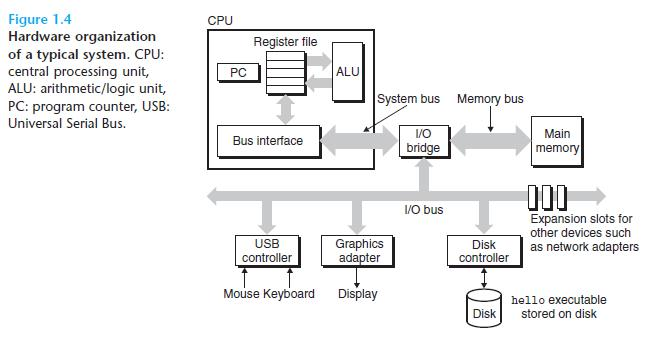
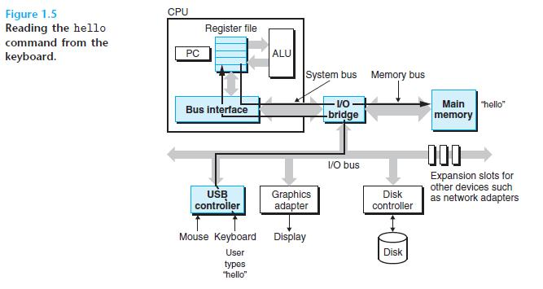
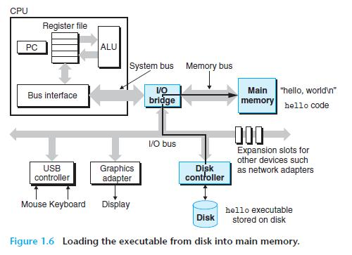
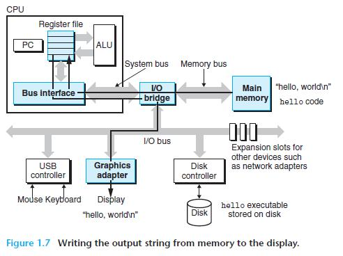
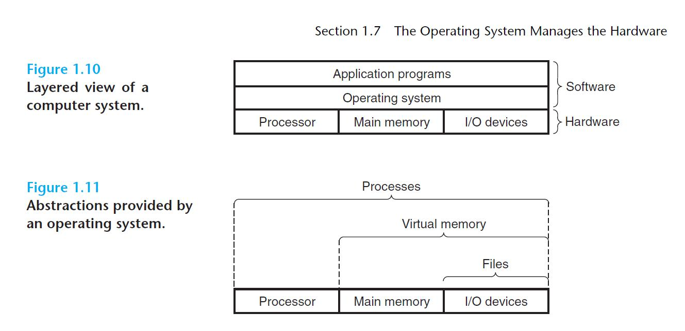
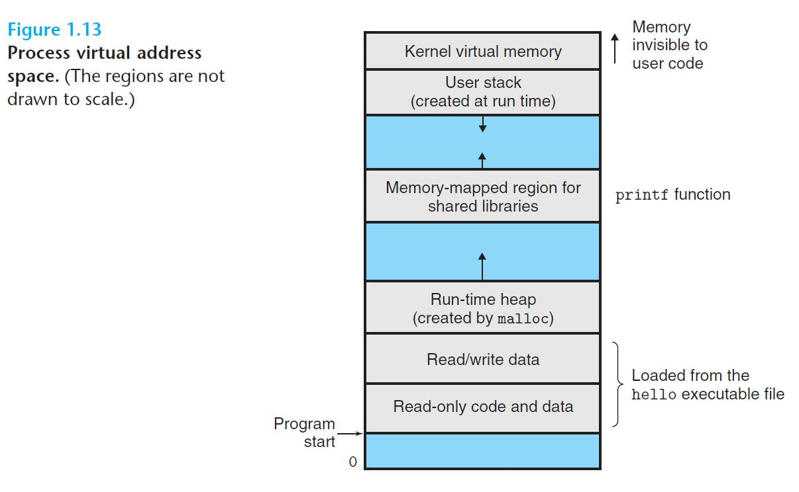

# CSAPP

Computer System: A Programmer's Perspective -3rd Edition

[CMU 15213](https://www.youtube.com/playlist?list=PLcQU3vbfgCc9sVAiHf5761UUApjZ3ZD3x)

# Chapter 1: A Tour of Computer System

## 1.1: Infomation is Bits + Context

Files such as hello.c that consist exclusively
of ASCII characters are known as text files. All other files are known as binary
files.

For example, in different contexts, the same sequence of bytes
might represent an integer, floating-point number, character string, or machine
instruction.

**depends on how to read it**

## 1.2 programs are Translated by other programs into different forms


**the compilation sythem**

```plantuml
@startuml
title state-c-to-program
[*] -> hello.c 
hello.c : source program\n (text)

hello.c -> hello.i : Pre-processor **cpp**
hello.i : modified source\n program (text)

hello.i -> hello.s : Compiler **ccl**
hello.s : Assembly program\n (text)

hello.s -> hello.o : Assembler, **as**
hello.o : Relocatable object\n program (binary)

printf.o --> hello : Linker **ld**

hello.o -> hello : Linker **ld**
hello : Executable object\n program (binary)

hello -> [*]
@enduml
```

**Understanding link-time errors**. In our experience, some of the most perplexing
programming errors are related to the operation of the linker,

`hello` is ready to be loaded into memory and executed by the system.

## 1.4 Processors read and interpret instructions stored in memory

**Hardware Organization of a typical system**



- Buses
- I/O Devices
- Main Memory
- Processor

PC: program counter, addr of next instruction








## 1.7 the operating system manages the hardwares



