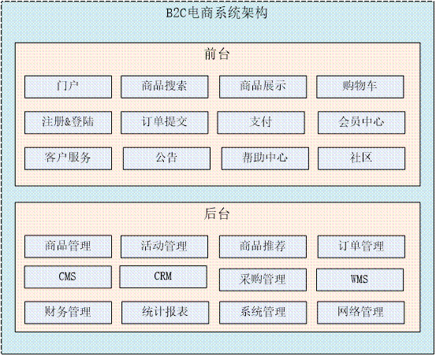
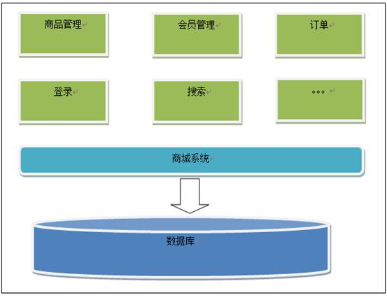
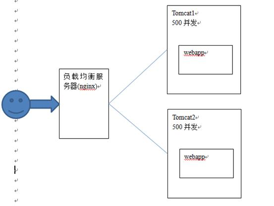
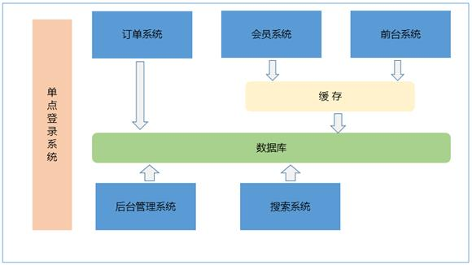
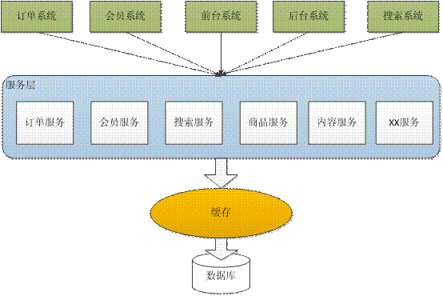
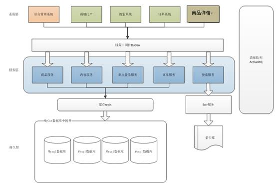
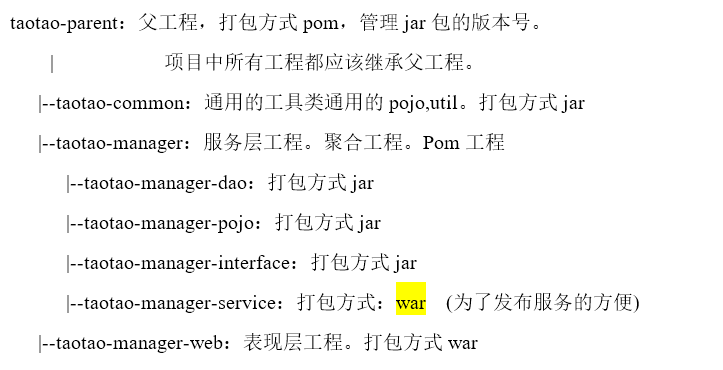

# JAVA Jargons

# 淘淘商城

## 1.1. 系统功能图

## 1.2. 系统功能介绍

后台管理系统：管理商品、订单、类目、商品规格属性、用户管理以及内容发布等功能。

前台系统：用户可以在前台系统中进行注册、登录、浏览商品、首页、下单等操作。

会员系统：用户可以在该系统中查询已下的订单、收藏的商品、我的优惠券、团购等信息。

订单系统：提供下单、查询订单、修改订单状态、定时处理订单。

搜索系统：提供商品的搜索功能。

单点登录系统：为多个系统之间提供用户登录凭证以及查询登录用户的信息。

# 2.   系统架构

## 2.1. 传统架构

### 2.1.1.    500并发

如图：**5.1**

 

存在的问题：

       1、功能耦合度高
    
       2、系统维护成本高
    
       3、如果并发量大，无法解决高并发的问题

### 2.1.2.    1000并发

存在的问题：

1、系统无法有效进行水平扩展（集群不能针对功能模块）**图****5.1**
2、用户存在重复登录的问题

针对第二点：需要session共享，是以session广播的形式，比较消耗资源，宽带。

如果要达到10000并发

需要20台服务器做tomcat集群。当tomcat集群中节点数量增加，服务能力先增加后下降。

所以集群中节点数量不能太多，一般也就5个左右。

## 2.2. 分布式架构（10000并发）

       需要按照功能点把系统拆分，拆分成独立的功能工程，可以单独为某一个节点添加服务器，需要系统之间配合才能完成整个业务逻辑这就叫做分布式。

**集群**：相当于同一个工程代码拷贝多份部署到多台服务器，每台服务器单独独立部署运行。

**分布式架构**：

       把系统按照模块拆分成多个子系统；多个子系统相互协作才能完成业务流程系统之间需要进行通信。

优点：

1、把模块拆分，使用接口通信，降低模块之间的耦合度。

2、把项目拆分成若干个子项目，不同的团队负责不同的子项目。

3、增加功能时只需要再增加一个子项目，调用其他系统的接口就可以。

4、可以灵活的进行分布式部署。

缺点：

1、系统之间交互需要使用远程通信，需要开发接口，增加工作量。
2、各个模块有一些通用的业务逻辑无法公用。

### 2.2.1.    基于SOA的架构

       SOA：Service Oriented Architecture面向服务的架构。也就是把工程都拆分成服务层工程、表现层工程。服务层中包含业务逻辑，只需要对外提供服务即可。表现层只需要处理和页面的交互，业务逻辑都是调用服务层的服务来实现。工程都可以独立部署。

## 2.3. 淘淘商城系统架构

### FILE STRUCTURE

# Frameworks

## Spring、SpringMVC、Mybatis
## JSP、JSTL、jQuery、EasyUI、KindEditor（富文本编辑器）
## Redis（缓存服务器，单点登录，购物车）
## Solr（搜索）
## dubbo（分布式服务框架）
## HttpClient（HTTP 协议访问客户端）
## ActiveMQ（消息队列）
## Quartz（定时任务）
## FastDFS（图片服务器）
## FreeMarker（Template engine）
## Nginx（反向代理服务器,  LOAD BALANCE）
## MyCat（数据库中间件）
