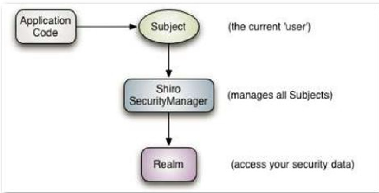

# Day 2

## Issues

### **`#issue 1`: not consistent between hibernate query and oracle inside.**

 `closed`: [@see also: solution-1](### solution-1)

**hibernate**

```java
list = {ArrayList@9904}  size = 10
 0 = {Dep@9958} "Dep [uuid=17, name=depName, tele=depTele]"
 1 = {Dep@9959} "Dep [uuid=21, name=depName, tele=depTele]"
 2 = {Dep@9960} "Dep [uuid=25, name=depName1, tele=depTele3]"
 3 = {Dep@9961} "Dep [uuid=2, name=管理员组, tele=000000]"
 4 = {Dep@9962} "Dep [uuid=3, name=总裁办, tele=111111]"
 5 = {Dep@9963} "Dep [uuid=4, name=采购部, tele=222222]"
 6 = {Dep@9964} "Dep [uuid=5, name=销售部, tele=333333]"
 7 = {Dep@9965} "Dep [uuid=6, name=公关部, tele=444444]"
 8 = {Dep@9966} "Dep [uuid=7, name=行政部, tele=555555]"
 9 = {Dep@9967} "Dep [uuid=8, name=人事部, tele=555555]"
```

**oracle inside**

![oracle-query.png][]

### solution-1

> delete chrome's cookie data.

**Note**: there is a option inside chrome, **disable cache**.

## Conclusion

### preparation

`oracle`, `maven`, `ssh`, `jQuery`

### easy ui

#### datagrid: create, pagination, formatter, toolbar, load, reload, getData, events

```js
<table id="grid"></table>

<script>
    // create and init
    $(function(){
    	 $('#grid').datagrid({
            url: 'dep_list.action',
            columns: [[
                {field: 'uuid', title: 'uuid', width: 100},
                {field: 'name', title: 'name', width: 100},
                {field: 'tele', title: 'tele', width: 100, align: 'right'},
                {
                    field: '-', title: '操作', formatter: function (value, row, index) {
                        var oper = "<a href=\"javascript:void(0)\" onclick=\"edit(" + row.uuid + ')">修改</a>';
                        oper += ' <a href="javascript:void(0)" onclick="del(' + row.uuid + ')">删除</a>';
                        return oper;
                    }
                }
            ]],
            striped: true,
            singleSelect: true,
            pagination: true,
            toolbar: [
                {
                    iconCls: 'icon-add',
                    text: 'add',
                    handler: function () {
                        $('#editDlg').dialog('open');
                        //清空表单内容
                        $('#editForm').form('clear');
                        // default content
                        $('#editForm').form('load', {
                            'dep.name': 'depName',
                            'dep.tele': 'depTele'
                        });

                        method = 'add';
                    }
                }
            ]
        });
    
    // load and getData
    $("#btnSearch").bind("click", function () {
            var formData = $("#searchForm").serializeJSON();
            $("#grid").datagrid("load", formData);
            // console.log($('#grid').datagrid('getData'));
        });
    
    // events
    $('#grid').datagrid({
        onLoadSuccess: function (data) {
            console.log(data);
        }
    });
});
</script>
```

#### messager: confirm, show, alert

```js
    del = function (uuid) {
        $.messager.confirm('confirm', 'are you sure?', function (yes) {
            if (yes) {
                $.ajax('dep_delete?id=' + uuid, {
                    dataType: 'json',
                    type: 'post',
                    success: function (rtn) {
                        $.messager.alert('prompt', rtn.message, 'info', function () {
                            $('#grid').datagrid('reload');
                        });
                    }
                });
            }
        });

    };
```

#### ajax

```js
$.ajax('dep_delete?id=' + uuid, {
                    dataType: 'json',
                    type: 'post',
                    success: function (rtn) {
                        $.messager.alert('prompt', rtn.message, 'info', function () {
                            $('#grid').datagrid('reload');
                        });
```

#### dialog

```html
<div id="editDlg">
    <form id="editForm">
        <table>
            <tr>
                <td>部门名称</td>
                <td><input name="dep.name"><input type="hidden" name="dep.uuid"/></td>
            </tr>
            <tr>
                <td>部门电话</td>
                <td><input name="dep.tele"></td>
            </tr>
        </table>
        <button id="btnSave" type="button">保存</button>
    </form>
</div>
```


```js
$('#editDlg').dialog({
            title: '部门编辑',
            width: 300,
            height: 200,
            closed: true,//窗口是是否为关闭状态, true：表示关闭
            modal: true//模式窗口
        });
```

open and close

```js
$('#editDlg').dialog('open');

$('#editDlg').dialog('close');
```

#### form: `jquery.serializejson.js`

```js
var formData = $('#editForm').serializeJSON();

//清空表单内容
$('#editForm').form('clear');
//加载数据
$('#editForm').form('load', 'dep_get?id=' + uuid);

$('#editForm').form('load', {
    'dep.name': 'depName',
    'dep.tele': 'depTele'
});
```

### fastjson-1.2.8.jar

```java
Map<String, Object> map = JSON.parseObject(jsonString);

JSON.toJSONString(dataMap);
```

# Day 3

## Conclusion

### easy ui

#### datagrid radio

```js
 {
     field: 'gender', title: '性别', width: 100, formatter: function (value, row, index) {
         value = row.gender;
         if (1 == value * 1) {
             return '男';
         }
         if (0 == value * 1) {
             return '女';
         }
     }
 },
```


#### Date format

```js
Date.prototype.Format = function(fmt)
{ //author: meizz
    if(isNaN(this.getDate()))
    {
        return "";
    }

    var o = {
        "M+" : this.getMonth()+1,                 //月份
        "d+" : this.getDate(),                    //日
        "h+" : this.getHours(),                   //小时
        "m+" : this.getMinutes(),                 //分
        "s+" : this.getSeconds(),                 //秒
        "q+" : Math.floor((this.getMonth()+3)/3), //季度
        "S"  : this.getMilliseconds()             //毫秒
    };
    if(/(y+)/.test(fmt))
        fmt=fmt.replace(RegExp.$1, (this.getFullYear()+"").substr(4 - RegExp.$1.length));
    for(var k in o)
        if(new RegExp("("+ k +")").test(fmt))
            fmt = fmt.replace(RegExp.$1, (RegExp.$1.length==1) ? (o[k]) : (("00"+ o[k]).substr((""+ o[k]).length)));
    return fmt;
}

{
    field: 'birthday', title: '出生年月日', width: 100, formatter: function (value) {
        return new Date(value).Format("yyyy-MM-dd");
    }
}
```

#### combobox

```html
<tr>
    <td>部门</td>
    <td><input name="t.dep.uuid" class="easyui-combobox" data-options="
    url:'dep_list', textField:'name', valueField:'uuid',required:true
    "></td>
</tr>
```

#### validation

```html
<tr>
    <td>邮件地址</td>
    <td><input name="t.email" class="easyui-validatebox" data-options="
        required:true,validType:'email',invalidMessage:'Email格式不正确'
        "></td>
</tr>
```

#### easyui-datebox

```html
 <tr>
     <td>出生年月日</td>
     <td><input name="t.birthday" class="easyui-datebox" editable="false"></td>
</tr>
```


### java

`@JSONField(serialize = false)`

```java
//不转换json字符串
@JSONField(serialize = false)
private String pwd;//登陆密码

```


# Day 4

## menu entity: auto related

## shiro Framework

`org.apache.shiro`

> Apache Shiro是一个强大且易用的Java安全框架,执行身份验证、授权、密码和会话管理。使用Shiro的易于理解的API,您可以快速、轻松地获得任何应用程序,从最小的移动应用程序到最大的网络和企业应用程序。

```xml
<shiro.version>1.2.3</shiro.version>

<dependency>
    <groupId>org.apache.shiro</groupId>
    <artifactId>shiro-core</artifactId>
    <version> ${shiro.version}</version>
</dependency>
<dependency>
    <groupId>org.apache.shiro</groupId>
    <artifactId>shiro-web</artifactId>
    <version> ${shiro.version}</version>
</dependency>
<dependency>
    <groupId>org.apache.shiro</groupId>
    <artifactId>shiro-aspectj</artifactId>
    <version> ${shiro.version}</version>
</dependency>
<dependency>
    <groupId>org.apache.shiro</groupId>
    <artifactId>shiro-spring</artifactId>
    <version>${shiro.version}</version>
</dependency>
```

### MD5

```java
	/**
	 * 加密
	 * @param source
	 * @param salt
	 * @return
	 */
	private String encrypt(String source, String salt){
		Md5Hash md5 = new Md5Hash(source, salt, hashIterations);
		return md5.toString();
	}
```

## `request.js`

>ndex.htm?参数1=数值1&参数2=数值2&参数3=数据3&参数4=数值4
>
>静态html文件js读取url参数，根据获取html的参数值控制html页面输出。

# Day 5

> see commit `7e353ed5e3d0f81c62a642bdbaeab1f2cfbaef39`

## Easy UI

![datagrid-common-method.png][]

![clickRow-and-editor.png][]

# Day 6

# Day 7
# Day 8

## `highchart.js` 

# Day 9

## java mail & QuartZ

> mail and job schedule

## sql join & view

```sql
--左边数据
select g.uuid,g.name,sum(nvl(num,0)) from goods g, storedetail s
where g.uuid = s.goodsuuid(+)
group by g.uuid,g.name;

--标准的sql写法
select g.uuid,g.name,sum(nvl(num,0)) from goods g left join storedetail s
on g.uuid = s.goodsuuid
group by g.uuid,g.name;

--右边的数据：
select ol.goodsuuid,sum(ol.num) as outnum from orderdetail ol, orders s
where s.uuid=ol.ordersuuid
and s.type='2' and ol.state='0'
group by ol.goodsuuid;

--关联起来
select a.uuid,a.name,a.storenum,b.outnum from (
  select g.uuid,g.name,sum(nvl(num,0)) storenum from goods g, storedetail s
  where g.uuid = s.goodsuuid(+)
  group by g.uuid,g.name
) a, (
  select ol.goodsuuid,sum(ol.num) as outnum from orderdetail ol, orders s
  where s.uuid=ol.ordersuuid
  and s.type='2' and ol.state='0'
  group by ol.goodsuuid
) b
where a.uuid =b.goodsuuid 
and a.storenum < b.outnum;

--视图使用的场景：
--关联表比较多，Sql比较复杂，业务复杂多变
--视图里嵌入视图

--创建视图
CREATE VIEW VIEW_STOREALERT AS
select a.uuid,a.name,a.storenum,b.outnum from (
  select g.uuid,g.name,sum(nvl(num,0)) storenum from goods g, storedetail s
  where g.uuid = s.goodsuuid(+)
  group by g.uuid,g.name
) a, (
  select ol.goodsuuid,sum(ol.num) as outnum from orderdetail ol, orders s
  where s.uuid=ol.ordersuuid
  and s.type='2' and ol.state='0'
  group by ol.goodsuuid
) b
where a.uuid =b.goodsuuid;

--使用视图查询
select * from view_storealert where storenum<outnum;
```

# Day 10

## `poi.jar`, `download.js`

# Day 11

## `cxf.jar`

> web service framework.
>
> demo proj: `F:\CS\blackHorse\code\redsun_parent`


# Day 12 Easyui--Thee插件_权限管理_权限菜单_用户角色权限


# Day 13 shiro框架认证管理授权管理



# Day 14
# Day 15


[oracle-query.png]: images/oracle-query.png
[datagrid-common-method.png]: images/datagrid-common-method.png
[clickRow-and-editor.png]: images/clickRow-and-editor.png
[shiro-arch.png]: images/shiro-arch.png

