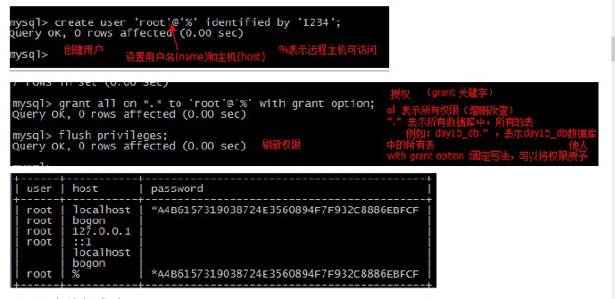

# Linux tutorial

# Enviroment variable

## Query

```shell
# all
env
set
locale

# specific
echo $LANG

// PATH
echo $PATH
```

## Set & `/etc/profile`

```shell
# temp, in current session

# change already exist
LANG='zh_CN.UTF-8'
```

`/etc/profile`, change permanently

```shell
# set java enviroment
JAVA_HOME=/usr/local/src/java/jdk1.8.0_192
CLASSPATH=.:$JAVA_HOME/lib/tools.jar:$JAVA_HOME/lib/*.jar
PATH=$JAVA_HOME/bin:$PATH

export JAVA_HOME CLASSPATH PATH
```

# vim

## Path

```shell
# get into vim, command mode

// see vim run time variable
:echo $VIM
:echo $VIMRUNTIME
:set runtimepath

// see loaded .vim file
:script
```

## `/etc/vimrc`

```shell
# basic

# UI, need to download colorscheme
syntax on
set background=dark
colorscheme monokai

# search
set hlsearch
set ignorecase
set incsearch

# easy window
map <c-j> <c-w><c-j>

# and some others
```

# Install software

## source

**install ruby**

1. source code.

```shell
#这个下载太慢了
wget https://cache.ruby-lang.org/pub/ruby/2.4/ruby-2.4.2.tar.gz
 
# 这个是我存在七牛的
# wget http://yellowcong.qiniudn.com/ruby-2.4.2.tar.gz
```

2. compile & install

```shell
#安装编译包
#yum -y install gcc gcc-c++ autoconf automake make
 
#解压
tar -zxvf ruby-2.4.2.tar.gz 
 
#配置,将ruby安装到/usr/local目录
./configure --prefix=/usr/local/ruby-2.4.2
 
#编译安装，需要注意的是是否有gcc等一些编译包
make && make install 
```

3. export path

```shell
#建立软连接，或则添加环境变量
#ln -s /usr/local/ruby-2.4.2/bin/ruby /usr/bin/ruby
 
#编辑环境变量，这种方法可以一次解决/usr/local/ruby-2.4.2/bin 的所有需要软连接的程序
vim /etc/profile
export RUBY_BIN=/usr/local/ruby-2.4.2/bin
export PATH=$PATH:$RUBY_BIN
#让修改的的环境变量生效
source /etc/profile
 
# test, 查看版本
ruby -v
```


## rpm

> Linux rpm 命令用于管理套件。
>
> rpm(redhat package manager) 原本是 Red Hat Linux 发行版专门用来管理 Linux 各项套件的程序，由于它遵循 GPL 规则且功能强大方便，因而广受欢迎。逐渐受到其他发行版的采用。RPM 套件管理方式的出现，让 Linux 易于安装，升级，间接提升了 Linux 的适用度。

**rpm常见命令参数**

```shell
用法: rpm [选项...]
-a：查询所有套件；
-b<完成阶段><套件档>+或-t <完成阶段><套件档>+：设置包装套件的完成阶段，并指定套件档的文件名称；
-c：只列出组态配置文件，本参数需配合"-l"参数使用；
-d：只列出文本文件，本参数需配合"-l"参数使用；
-e<套件档>或--erase<套件档>：删除指定的套件；
-f<文件>+：查询拥有指定文件的套件；
-h或--hash：套件安装时列出标记；
-i：显示套件的相关信息；
-i<套件档>或--install<套件档>：安装指定的套件档；
-l：显示套件的文件列表；
-p<套件档>+：查询指定的RPM套件档；
-q：使用询问模式，当遇到任何问题时，rpm指令会先询问用户；
-R：显示套件的关联性信息；
-s：显示文件状态，本参数需配合"-l"参数使用；
-U<套件档>或--upgrade<套件档>：升级指定的套件档；
-v：显示指令执行过程；
-vv：详细显示指令执行过程，便于排错。
--nodeps: no check for dependencies
```

```shell
rpm -ivh your-package                # 直接安装

rpm -ql tree        # 查询
rpm -e --nodeps tree          # 卸载
rpm -ql tree         # 查询

rpm -qa | grep -i vim
```

## yum

> yum（ Yellow dog Updater, Modified）是一个在Fedora和RedHat以及SUSE中的Shell前端软件包管理器。
>
> 基於RPM包管理，能够从指定的服务器自动下载RPM包并且安装，可以自动处理依赖性关系，并且一次安装所有依赖的软体包，无须繁琐地一次次下载、安装。
>
> yum提供了查找、安装、删除某一个、一组甚至全部软件包的命令，而且命令简洁而又好记。

**Commands**

1. 列出所有可更新的软件清单命令：`yum check-update`
2. 更新所有软件命令：`yum update`
3. 仅安装指定的软件命令：`yum install <package_name>`
4. 仅更新指定的软件命令：`yum update <package_name>`
5. 列出所有可安裝的软件清单命令：`yum list`
6. 删除软件包命令：`yum remove <package_name>`
7. 查找软件包 命令：`yum search <keyword>`
8. 清除缓存命令:
  - `yum clean packages`: 清除缓存目录下的软件包
  - `yum clean headers`: 清除缓存目录下的 headers
  - `yum clean oldheaders`: 清除缓存目录下旧的 headers
  - `yum clean, yum clean all (= yum clean packages; yum clean oldheaders)` :清除缓存目录下的软件包及旧的headers

### SETUP `/etc/yum.repos.d`

> 国内 yum 源
> 网易（163）yum源是国内最好的yum源之一 ，无论是速度还是软件版本，都非常的不错。
>
> 将yum源设置为163 yum，可以提升软件包安装和更新的速度，同时避免一些常见软件版本无法找到。
>

安装步骤
首先**备份**/etc/yum.repos.d/CentOS-Base.repo

```shell
mv /etc/yum.repos.d/CentOS-Base.repo /etc/yum.repos.d/CentOS-Base.repo.backup
```

下载对应版本 repo 文件, 放入 /etc/yum.repos.d/ (操作前请做好相应备份)

CentOS7 ：http://mirrors.163.com/.help/CentOS7-Base-163.repo

```shell
curl http://mirrors.163.com/.help/CentOS7-Base-163.repo -o CentOS-Base.repo
```

运行以下命令生成缓存

```shell
yum clean all
yum makecache
```

## tar

> **打包**：将一大堆文件或目录变成一个总的文件【tar命令】
> **压缩**：将一个大的文件通过一些压缩算法变成一个小文件【gzip，bzip2等】
>
> Linux中很多压缩程序只能针对一个文件进行压缩，这样当你想要压缩一大堆文件时，你得将这一大堆文件**先打成一个包（tar命令），然后再用压缩程序进行压缩**（gzip bzip2命令）。
>

tar语法
语法：tar [主选项+辅选项] 文件或目录

使用该命令时，主选项必须有，它告诉tar要做什么事情，辅选项是辅助使用的，可以选用。

主选项：**一条命令以下5个参数只能有一个**

-c: --create 新建一个压缩文档，即打包
-x: --extract,--get解压文件
-t: --list,查看压缩文档里的所有内容
-r:--append 向压缩文档里追加文件
-u:--update 更新原压缩包中的文件

辅助选项：

-z:是否同时具有gzip的属性？即是否需要用gzip压缩或解压？一般格式为**xxx.tar.gz或xx.tgz**
-j：是否同时具有bzip2的属性？即是否需要用bzip2压缩或解压？一般格式为**xx.tar.bz2**
-v:显示操作过程！这个参数很常用
-f：使用文档名，**注意，在f之后要立即接文档名，不要再加其他参数！**
-C:切换到指定目录

**解压方法总结**

- *.tar 用 tar –xvf 解压
- *.gz 用 gzip -d或者gunzip 解压
- *.tar.gz和*.tgz 用 tar –xzf 解压
- *.bz2 用 bzip2 -d或者用bunzip2 解压
- *.tar.bz2用tar –xjf 解压
- *.Z 用 uncompress 解压
- *.tar.Z 用tar –xZf 解压
- *.rar 用 unrar x 解压
- *.zip 用 unzip 解压

## Linux查看software 安装路径

### 查看文件安装路径

由于软件安装的地方不止一个地方，所有先说查看文件安装的所有路径(地址)。

这里以mysql为例。比如说我安装了mysql,但是不知道文件都安装在哪些地方、放在哪些文件夹里，可以用下面的命令查看所有的文件路径 
在终端输入：

```shell
whereis mysql
```

回车，如果你安装好了mysql，就会显示文件安装的地址，例如我的显示(安装地址可能会不同)

```shell
[root@localhost ~]# whereis mysql 
mysql: /usr/bin/mysql /usr/lib/mysql /usr/share/mysql /usr/share/man/man1/mysql.1.gz
```

### 查询运行文件所在路径(文件夹地址)

如果你只要查询文件的运行文件所在地址，直接用下面的命令就可以了(还是以mysql为例)：

```shell
which mysql

# 终端显示:

[root@localhost ~]# which mysql 
/usr/bin/mysql
```
## install mysql

```shell
# query leagcy software and uninstall
# yum info mysql-server
# yum remove mysql-server

# yum install follow a file, install from local
yum install mysql-server*.rpm mysql-client*.rpm

# configure my.cnf, basic content like below
mv /usr/my.cnf /etc/my.cnf

# success if promp START SUCCESSFUL
service mysql start

# stop 
service mysql stop
```

```properties
[client]
port = 3306
socket = /var/lib//mysql/mysql.sock
default-character-set = utf8

[mysqld]

# generic configuration options
port = 3306
socket = /var/lib/mysql/mysql.sock
datadir = /var/lib/mysql

character-set-server = utf8
collation-server = utf8_general_ci
```

### fisrt login failed

**Reset a MySQL root password**

>The MySQL root password allows the root user to have full access to the MySQL database. You must have (Linux) root or (Windows) Administrator access to the Cloud Server to reset the MySQL root password.

```shell
# stop mysql
sudo service mysql stop

# start mysql without password
sudo mysqld_safe --skip-grant-tables &

# connect to mysql
mysql -u root

# set new mysql root password
use mysql;
update user set password=PASSWORD("newpwd") where User='root'
flush privileges;

# stop and start, then log can normally
sudo service mysql stop
```

```sql
-- fisrt run mysql in another shell
set password=PASSWORD("123456");
```

### Remote connect

**mysql host CentOS setup**

```shell
# close virtual machine firewall, or add mysql port 3306 to firewall

# add
firewall-cmd --zone=public --add-port=3306/tcp --permanent

# close
# systemctl disable firewalld.service
```

```sql
use mysql;
select user,host,password from user;
-- create user and password
create user 'root'@'%' identified by '1234';
grant all on *.* to 'root'@'%' with grant option;
flush privileges;
```



**remote mysql client**

```sql
mysql -h 192.168.136.128 -u root -p
```

## Install Redis

**redis.conf**

```vim
daemonize yes
port 6379
```

**dependency `gcc-c++`**

> redis is c implemented, build with gcc

**build**

```shell
make PREFIX=/usr/local/redis install
```

```shell
# start server in background
redis-server redis.conf

# shutdown gracefully
redis-cli shutdown

# remote access
redis-cli -h 192.168.136.128 -p 6397
```

# Others

## Query system info

```shell
# 1.all linux release
cat /etc/issue

# 2.
cat /proc/version

#
uname -a
```

## Query ip

```shell
ifconfig
```

## `firewalld and systemctl`

### firewalld的基本使用

启动： systemctl start firewalld
关闭： systemctl stop firewalld
查看状态： systemctl status firewalld 
开机禁用  ： systemctl disable firewalld
开机启用  ： systemctl enable firewalld


### systemctl是CentOS7的服务管理工具中主要的工具，它融合之前service和chkconfig的功能于一体。

启动一个服务：systemctl start firewalld.service
关闭一个服务：systemctl stop firewalld.service
重启一个服务：systemctl restart firewalld.service
显示一个服务的状态：systemctl status firewalld.service
在开机时启用一个服务：systemctl enable firewalld.service
在开机时禁用一个服务：systemctl disable firewalld.service
**查看服务是否开机启动：systemctl is-enabled firewalld.service**
**查看已启动的服务列表：systemctl list-unit-files|grep enabled**
查看启动失败的服务列表：systemctl --failed

==**query startup service: systemctl status --all**==

### 配置firewalld-cmd

查看版本： firewall-cmd --version
查看帮助： firewall-cmd --help
显示状态： firewall-cmd --state
**查看所有打开的端口**： firewall-cmd --zone=public --list-ports
更新防火墙规则： firewall-cmd --reload
查看区域信息:  firewall-cmd --get-active-zones
查看指定接口所属区域： firewall-cmd --get-zone-of-interface=eth0
拒绝所有包：firewall-cmd --panic-on
取消拒绝状态： firewall-cmd --panic-off
查看是否拒绝： firewall-cmd --query-panic

那怎么开启一个端口呢
**添加**
firewall-cmd --zone=public --add-port=80/tcp --permanent    （--permanent永久生效，没有此参数重启后失效）
重新载入
firewall-cmd --reload
查看
firewall-cmd --zone= public --query-port=80/tcp
**删除**
firewall-cmd --zone= public --remove-port=80/tcp --permanent莫小安

