[TOC]

## sequece diagram

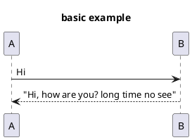

### overview

1. default type is `participant`, `->` and `<--`

2. types
    - actor
    - entity
    - collection
    - database
    - control
    - boundary

> order as they declared

3. alias `as`, color `#rgb`

4. title and note

5. text wrapping, `\n` or skinParameter `maxMessageSize`

### declaring

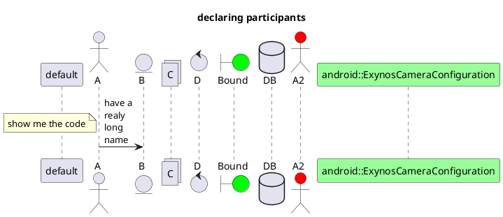

### arrow styles

1. `->, -->, -\, ->x, ->o, <->`, double for a thin drawing
2. color, `-[#red]>`

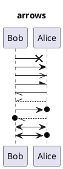

### message sequece autonumber

- `autonumber start increment "msg foramt 0"`, 0 is the number

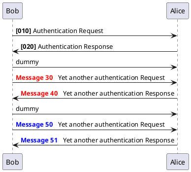

### page title, header and footer

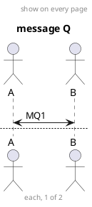

### grouping messages

1. keywords
   - alt/else
   - opt
   - loop
   - group

2. `end`

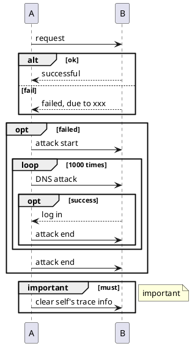

### notes on message

1. `note left` or `note right`, related to **arrow**
2. multiple line notes, using `end note`

3. `left of, right of, over`, related to **participant**, color applied

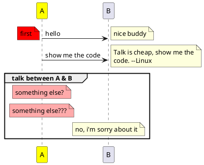

### markdown and HTML

leagcy HTML

```
<b> for bold text
<u> or <u:#AAAAAA> or <u:[[color|colorName]]> for underline
<i> for italic
<s> or <s:#AAAAAA> or <s:[[color|colorName]]> for strike text
<w> or <w:#AAAAAA> or <w:[[color|colorName]]> for wave underline text
<color:#AAAAAA> or <color:[[color|colorName]]>
<back:#AAAAAA> or <back:[[color|colorName]]> for background color
<size:nn> to change font size
 : the file must be accessible by the filesystem
 : the URL must be available from the Internet
```

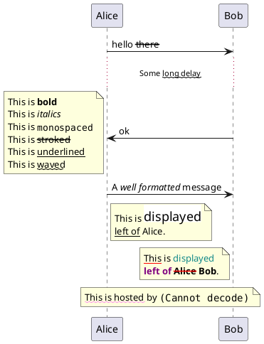

### divides, delay

1. `==, ...`

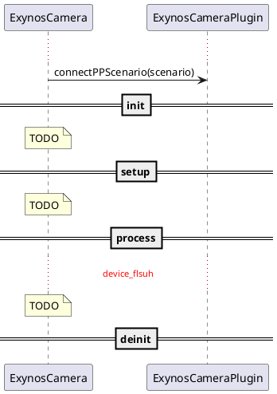

### lifetime activate and Destruction

1. `activate`, `deactive`, `create`, `destroy`, `return`

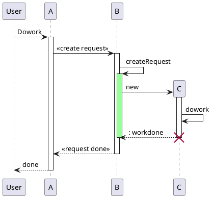

2. `++, --, **, !!`, activate, deactivate, create and destroy
3. The return point is that which caused the most recent life-line activation.

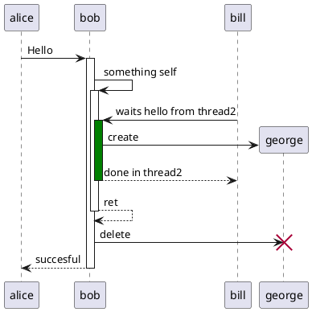

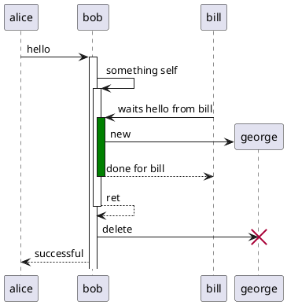

### incoming and outgoing messages

1. `[, ]`

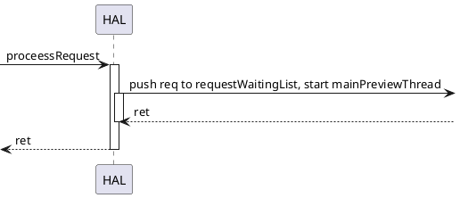

### anchors and duration

1. `{A}, {B}`
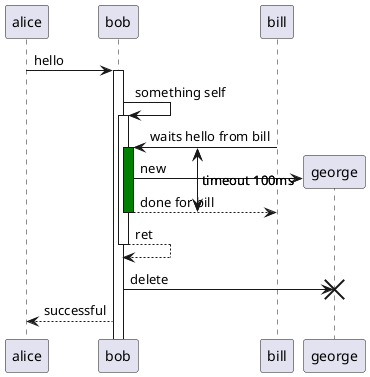

### participants encompass

1. `box`, `end box`

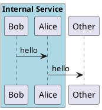

## use case

### basic

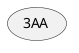

## Activity

### basic

1. `start` and `end`
2. `:activity;`
3. condition

```
if (A) then lableA
 activity1
else labelB
 activity2
endif
```

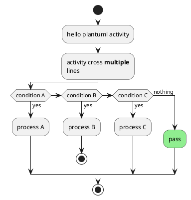